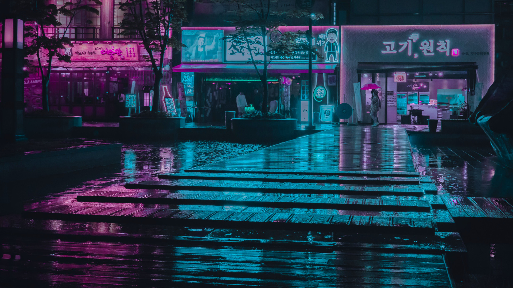
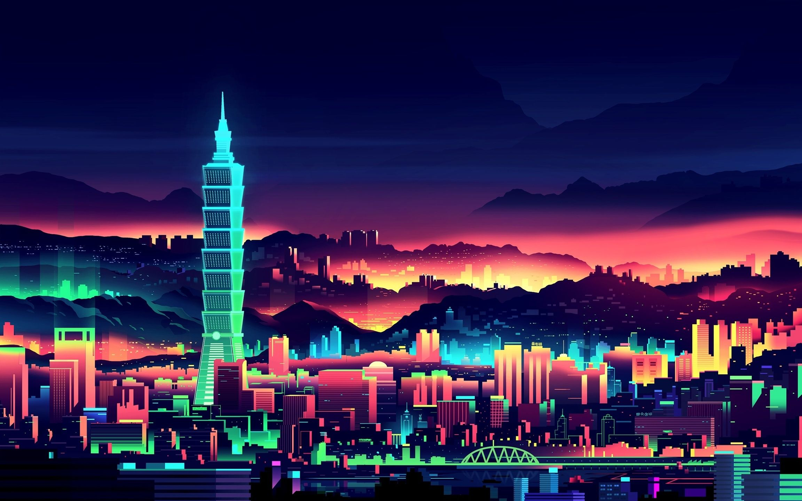
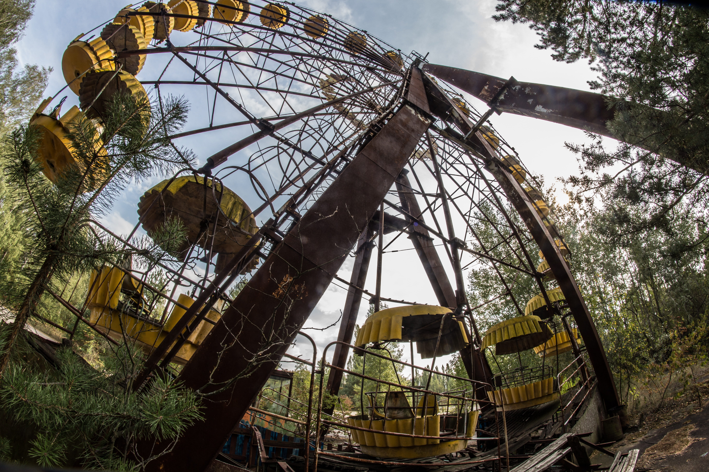
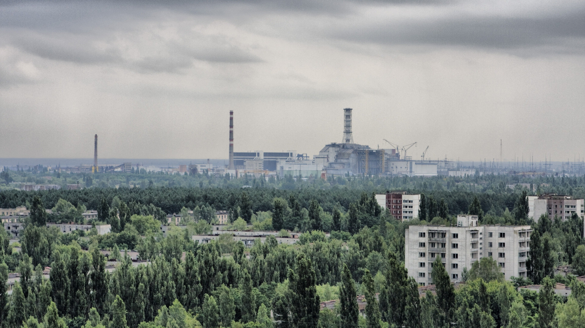
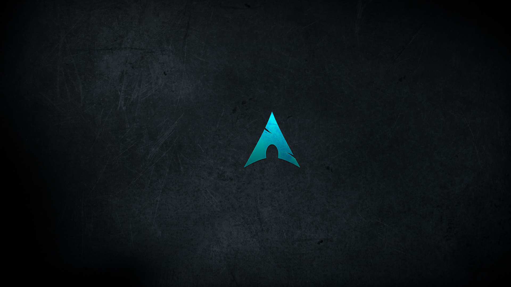
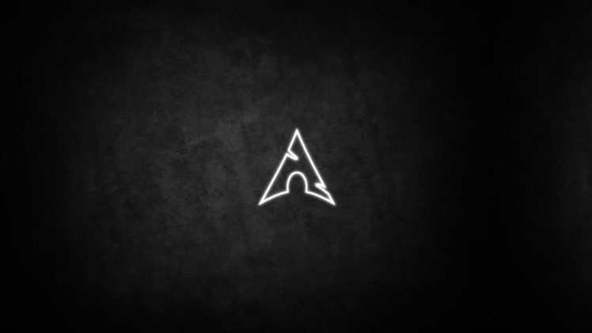
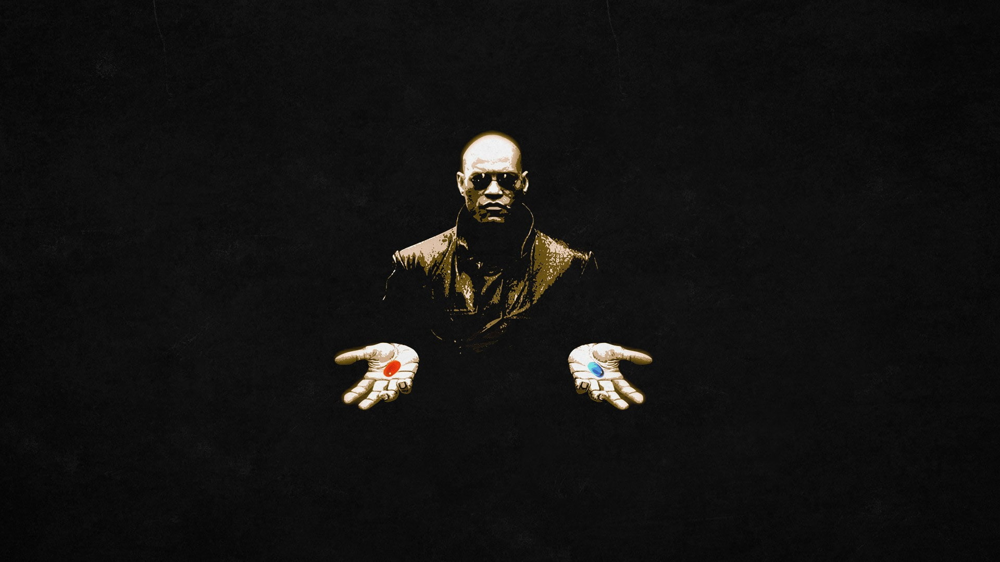
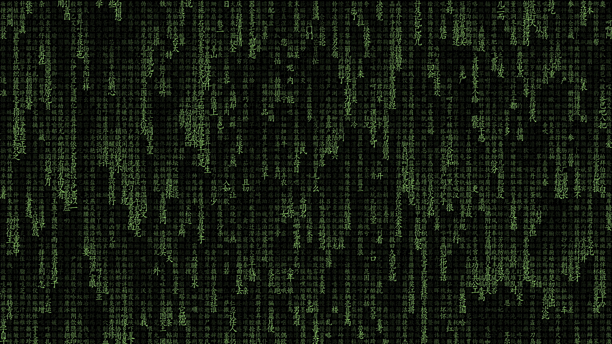

# Dotfiles


Hi, here you can explore the dotfiles I use on a daily basis.

- **Window Manager:** [bspwm](https://github.com/baskerville/bspwm)
- **Terminal:** [alacritty](https://github.com/alacritty/alacritty)
- **Shell:** [zsh](https://www.zsh.org/)
- **Bar:** [polybar](https://polybar.github.io/)
- **Editor:** [neovim](https://github.com/neovim/neovim)
- **File Manager:** [thunar](https://github.com/xfce-mirror/thunar)
- **Application Launcher:** [rofi](https://github.com/davatorium/rofi)

## Installation (Arch)

- After clean Arch installation you will need download git and text editor:

```bash
sudo pacman -S git neovim
```

- Install [yay](https://github.com/Jguer/yay#installation)
- Clone dotfiles:

```bash
git clone https://github.com/Azalurg/dotfiles.git
```

- Run installation script (!!! not ready yet !!!) or instal packages manually and copy config files.

```bash
cd dotfiles
sudo chmod +x setup
./setup
```

## Wallpapers

<table>
    <tr>
        <td></td>
        <td></td>
        <td></td>
    </tr>
    <tr>
        <td></td>
        <td></td>
        <td></td>
    </tr>
    <tr>
        <td></td>
        <td></td>
        <td></td>
    </tr>
    <tr>
        <td></td>
        <td></td>
        <td></td>
    </tr>
    <tr>
        <td></td>
        <td></td>
        <td></td>
    </tr>
</table>

<!-- ## Colorscheme -->

## Inspiration

Here is a list of developers/artists I get inspiration and source code from ;-)

|    Where/Who     |  Use  |
| :--------------: | :---: |
| [`janleigh`](https://github.com/janleigh/dotfiles)        | README.md |
| [`adi1090x`](https://github.com/adi1090x/rofi)            | rofi      |
| [`SolDoesTech`](https://github.com/SolDoesTech/hyprland)  | setup script |
| [`prasanthrangan`](https://github.com/prasanthrangan/hyprdots)  | neofetch |

## Todo

Sort by priority:

- [ ] color-schema / style / backgrounds
- [ ] dunst
- [ ] rofi - finish
- [ ] polybar - refresh
- [ ] script
- [x] neofetch
- [ ] [widgets](https://github.com/rxyhn/tokyo) ???
- [ ] picom
- [ ] gtk-3.0 ???
